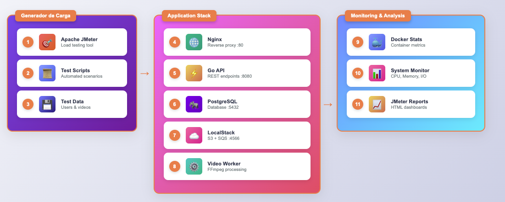
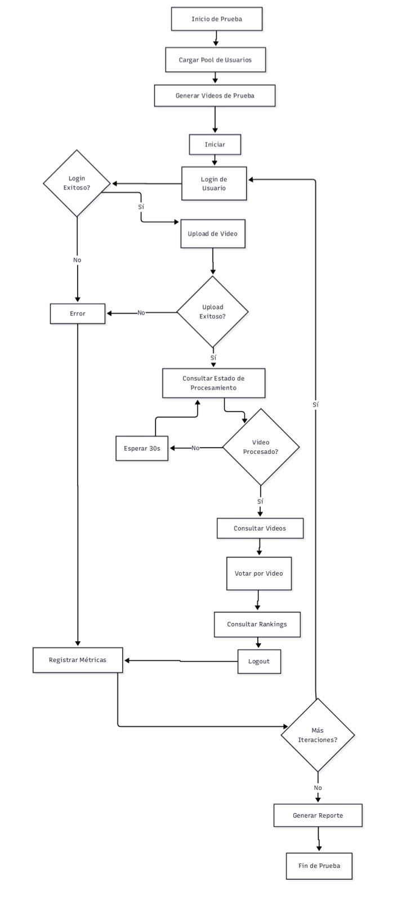

# Plan de Pruebas de Carga - Sistema de Procesamiento de Video

## 1. Herramienta de Pruebas de Carga

**Herramienta Principal**: Apache JMeter
- Interfaz gráfica para diseño de pruebas
- Soporte nativo para uploads de archivos
- Generación de reportes HTML automáticos
- Plugins para análisis avanzado de resultados

**Herramientas Complementarias**:
- Apache Bench (ab) para pruebas rápidas de endpoints
- cURL para validación individual de endpoints
- Docker stats para monitoreo de contenedores
- FFmpeg para generar videos de prueba
- Postman/Newman para validación funcional previa

## 2. Diseño del Entorno de Pruebas

### Infraestructura Base
- **Entorno Local**: Docker Compose (desarrollo y pruebas iniciales)
- **Entorno de Pruebas**: AWS EC2 o DigitalOcean (simulación producción)

### Especificaciones Mínimas
- **Servidor de Aplicación**: 2 vCPU, 4GB RAM (c5.large equivalent)
- **Base de Datos**: PostgreSQL en contenedor dedicado
- **Almacenamiento**: LocalStack S3 para desarrollo, S3 real para pruebas finales
- **Red**: Contenedores en red bridge dedicada
- **Instancia de Pruebas**: c5.large (2 vCPU, 4 GB RAM, 10 Gbps de red)

### Componentes a Evaluar
- API REST (Puerto 80 via Nginx)
- Worker de procesamiento de video
- Base de datos PostgreSQL
- Cola SQS (LocalStack)
- Almacenamiento S3 (LocalStack)
- FFmpeg: Herramienta de procesamiento de video

## 3. Criterios de Aceptación

### Métricas Principales
| Métrica | Objetivo | Límite Crítico |
|---------|----------|----------------|
| Tiempo de Respuesta API | < 500ms | < 1000ms |
| Tiempo de Upload (50MB) | < 60s | < 120s |
| Tiempo de Procesamiento (video 30s) | < 300s | < 600s |
| Throughput API | > 50 req/min | > 25 req/min |
| Throughput de Uploads | > 10 videos/min | > 5 videos/min |
| Tasa de Error | < 2% | < 5% |
| Disponibilidad | > 95% | > 90% |

### Utilización de Recursos
| Recurso | Objetivo | Límite Crítico |
|---------|----------|----------------|
| CPU Contenedores | < 70% | < 80% |
| CPU Workers | < 90% | < 95% |
| Memoria | < 80% | < 85% |
| Cola SQS | < 50 mensajes | < 100 mensajes pendientes |
| Almacenamiento | Monitor espacio | Disponible |

### Criterios de Éxito del Proyecto
- Sistema procesa videos sin corrupción de datos
- Cola de procesamiento no se satura
- Rankings se actualizan correctamente bajo carga
- No hay pérdida de archivos durante procesamiento intensivo

## 4. Diagrama de Arquitectura




### Componentes de la Topología

**Cliente (Generador de Carga)**:
- JMeter corriendo en máquina separada o contenedor dedicado
- Pool de usuarios virtuales (5-200 usuarios)
- Videos de prueba pre-generados (10MB, 25MB, 50MB, 100MB, 200MB)
- Pool de 100 usuarios de prueba preregistrados

**Red**:
- Conexión HTTP/HTTPS
- Posible limitación de ancho de banda para simular condiciones reales
- Security Groups: Puertos 80/443 abiertos hacia API

**Servidor**:
- Stack completo en Docker Compose
- Monitoreo via Docker stats
- Logs centralizados por contenedor

## 5. Estrategia de Pruebas - 3 Etapas

### Etapa 1: Pruebas de Humo
- **Objetivo**: Verificar funcionalidad básica de todos los endpoints
- **Usuarios**: 2-5 concurrentes
- **Duración**: 10 minutos
- **Criterio**: Todos los endpoints responden correctamente

### Etapa 2: Pruebas de Carga Normal
- **Objetivo**: Simular carga de producción esperada
- **Usuarios**: Incrementos de 5, 10, 20, 50 usuarios
- **Duración**: 15-20 minutos por escalón
- **Criterio**: Cumplir objetivos de rendimiento

### Etapa 3: Pruebas de Estrés
- **Objetivo**: Encontrar límites del sistema de procesamiento
- **Usuarios**: 75, 100, 150, 200+ usuarios
- **Duración**: 20-30 minutos por escalón
- **Criterio**: Identificar punto de saturación de workers

## 6. Escenarios de Prueba Detallados

### Escenario 1: Flujo Completo de Usuario Competidor
**Descripción**: Usuario sube video, espera procesamiento, verifica resultado

**Flujo de Transacciones**:
1. Autenticación (POST /api/auth/login)
2. Subida de video (POST /api/videos/upload)
3. Consulta de estado (GET /api/videos/:video_id) - repetida cada 30s
4. Visualización de video procesado (GET /api/public/videos)
5. Verificación de perfil (GET /api/auth/profile)

**Parámetros**:
- Videos de prueba: 30s duración, formato MP4, diferentes resoluciones
- Tiempo entre consultas de estado: 30 segundos
- Distribución: 60% uploads, 30% consultas, 10% visualización

### Escenario 2: Sistema de Votación y Rankings
**Descripción**: Usuarios públicos consultan videos y votan masivamente

**Flujo de Operaciones**:
1. Consulta de videos públicos (GET /api/public/videos)
2. Votación por video (POST /api/public/videos/:video_id/vote)
3. Consulta de rankings (GET /api/public/rankings)
4. Consulta de ranking específico (GET /api/public/rankings/:user_id)
5. Actualización de rankings (POST /api/public/rankings/refresh)

**Parámetros**:
- Ratio de votación: 1 voto por cada 5 visualizaciones
- Consulta de rankings cada 2 minutos
- Filtros de ciudad aplicados en 20% de consultas

## 7. Tabla Resumen de Escenarios

| Escenario | Tipo | Usuarios Max | Duración | Uploads/min Objetivo | Tiempo Procesamiento Objetivo |
|-----------|------|--------------|----------|---------------------|------------------------------|
| Humo API | Funcional | 5 | 10 min | N/A | N/A |
| Humo Upload | Funcional | 2 | 15 min | 2 | < 300s |
| Carga Upload | Normal | 20 | 30 min | > 10 | < 300s |
| Estrés Upload | Límite | 50 | 45 min | Hasta fallo | < 600s |
| Carga Votación | Normal | 100 | 20 min | N/A | < 200ms |
| Estrés Rankings | Límite | 200 | 30 min | N/A | < 500ms |

## 8. Diagrama de Flujo - Escenario Principal



## 9. Estructura de Archivos de Prueba

```
pruebas-carga/
├── plan_de_pruebas.md
├── jmeter/
│   ├── test-plans/
│   │   ├── 01-funcional-basico.jmx
│   │   ├── 02-carga-normal.jmx
│   │   ├── 03-estres-sistema.jmx
│   │   └── 04-escenario-completo.jmx
│   ├── data/
│   │   ├── usuarios.csv
│   │   └── videos-prueba/
│   │       ├── small-video-10mb.mp4
│   │       ├── medium-video-25mb.mp4
│   │       ├── large-video-50mb.mp4
│   │       ├── xlarge-video-100mb.mp4
│   │       └── xxl-video-200mb.mp4
├── scripts/
│   ├── setup-environment.sh
│   ├── generate-test-videos.sh
│   ├── run-tests.sh
│   └── monitor-system.sh
├── reportes/
│   ├── funcional/
│   ├── carga-normal/
│   └── estres/
└── README.md
```

## 10. Endpoints Críticos a Probar

### Autenticación
```
POST /api/auth/signup
POST /api/auth/login
POST /api/auth/logout
GET  /api/auth/profile
```

### Gestión de Videos
```
POST /api/videos/upload          # CRÍTICO - Upload de archivos grandes
GET  /api/videos/                # Lista de videos del usuario
GET  /api/videos/:video_id       # Estado de procesamiento
DELETE /api/videos/:video_id     # Eliminación de videos
```

### Endpoints Públicos
```
GET  /api/public/videos          # ALTO TRÁFICO - Videos públicos
POST /api/public/videos/:video_id/vote    # CRÍTICO - Sistema de votación
DELETE /api/public/videos/:video_id/vote  # Eliminar voto
GET  /api/public/rankings        # ALTO TRÁFICO - Rankings actualizados
GET  /api/public/rankings/:user_id       # Ranking específico
POST /api/public/rankings/refresh        # Actualización manual
```

## 11. Preparación del Entorno

### Videos de Prueba
- **Generar videos con FFmpeg** en diferentes tamaños y resoluciones:
  - 10MB (720p, 30s) - Videos móviles cortos
  - 50MB (1080p, 60s) - Videos estándar de competencia  
  - 100MB (1080p, 120s) - Videos de larga duración
  - 200MB (4K, 60s) - Videos de alta calidad
- **Formatos soportados**: MP4, AVI, MOV
- **Duraciones**: 10s, 30s, 60s, 120s

### Datos de Prueba
- 100 usuarios de prueba pre-registrados
- Diferentes perfiles de ciudad para testing de rankings (Bogotá, Medellín, Cali)
- Tokens JWT válidos para autenticación
- CSV con pool de usuarios y contraseñas

### Consideraciones Especiales para Video

#### Tamaños de Archivo
- **Pequeños (10-50MB)**: Simulan videos móviles cortos
- **Medianos (50-100MB)**: Videos estándar de competencia
- **Grandes (100-200MB)**: Videos de alta calidad o larga duración

#### Tipos de Procesamiento
- **Compresión**: Reducción de tamaño manteniendo calidad
- **Resize**: Ajuste de resolución y relación de aspecto
- **Overlay**: Adición de logo ANB y elementos gráficos
- **Encoding**: Conversión a formatos específicos

#### Patrones de Carga Específicos
- **Picos de Subida**: Simulación de eventos de competencia
- **Procesamiento Batch**: Múltiples videos en cola
- **Consultas de Estado**: Polling frecuente durante procesamiento

## 12. Monitoreo Durante Pruebas

### Métricas de API
- **Response Time** por endpoint (min, max, avg, p95, p99)
- **Throughput** (requests/second)
- **Error Rate** por endpoint (%, tipos de error)
- **Upload Success Rate** (%)

### Métricas de Procesamiento
- **Queue Depth** (mensajes en SQS)
- **Processing Time** por video (segundos)
- **Worker Utilization** (%)
- **Video Processing Success Rate** (%)

### Métricas de Sistema
- **CPU Utilization** (API servers + Workers)
- **Memory Usage** (API servers + Workers)
- **Network I/O** (especialmente uploads)
- **S3 Operations** (PUT/GET rates)
- **Disk I/O** en workers (temp files)
- **Database connections**

### Métricas de Negocio
- **Videos Uploaded per Hour**
- **Average Processing Time per Video Size**
- **Vote Conversion Rate**
- **Ranking Query Pattern Analysis**

## 13. Puntos de Falla Esperados

### Patrones de Comportamiento
- **Upload**: Throughput limitado por ancho de banda y procesamiento
- **API Queries**: Alta concurrencia con baja latencia esperada
- **Procesamiento**: Cola creciente bajo carga alta
- **Rankings**: Cache hit rate importante para rendimiento

### Puntos de Falla Críticos
1. **Saturación de Workers**: Cola SQS crece indefinidamente
2. **Límite de Ancho de Banda**: Uploads fallan o se ralentizan
3. **Límite de Almacenamiento**: Espacio en disco workers
4. **Base de Datos**: Conexiones agotadas por consultas de estado
5. **Memoria**: Workers consumen demasiada RAM procesando videos grandes

## 14. Entregables por Fase

### Entrega 2: Setup Inicial (Semanas 1-2)
- Configuración completa de JMeter
- Scripts de generación de datos de prueba
- Pruebas funcionales básicas (humo)
- Videos de prueba generados
- Documentación de setup

### Entrega 3: Pruebas de Carga (Semanas 3-4)
- Escenarios de carga normal implementados
- Reportes automatizados HTML
- Análisis de bottlenecks iniciales
- Métricas baseline establecidas
- Recomendaciones de optimización

### Entrega 4: Optimización y Estrés (Semanas 5-6)
- Pruebas de estrés completas
- Identificación de límites del sistema
- Plan de escalabilidad detallado
- Recomendaciones de mejora de arquitectura
- Reporte final consolidado

## 15. Consideraciones de Implementación

### Limitaciones del Entorno Local
- Recursos limitados comparado con producción
- LocalStack puede comportarse diferente a AWS real
- Red local sin latencia real de internet
- Un solo worker puede ser bottleneck

### Aspectos Técnicos
- Worker single-threaded puede limitar procesamiento
- Tamaño de videos impacta significativamente tiempo de procesamiento
- Almacenamiento temporal puede llenarse rápidamente
- FFmpeg consume recursos intensivamente

### Interpretación de Resultados
- Establecer baseline con sistema sin carga
- Comparar rendimiento entre diferentes tamaños de video
- Identificar puntos de saturación específicos
- Correlacionar métricas JMeter con métricas de sistema

## 16. Comandos de Ejecución

### Generación de Videos de Prueba
```bash
# Generar video de 10MB, 30 segundos
ffmpeg -f lavfi -i testsrc2=duration=30:size=1280x720:rate=30 -c:v libx264 -b:v 2500k small-video-10mb.mp4

# Generar video de 50MB, 60 segundos  
ffmpeg -f lavfi -i testsrc2=duration=60:size=1920x1080:rate=30 -c:v libx264 -b:v 6500k medium-video-50mb.mp4
```

### Ejecución de Pruebas JMeter
```bash
# Modo comando - Prueba funcional básica
jmeter -n -t funcional-basico.jmx -l results/functional.jtl -e -o reports/functional/

# Modo comando - Prueba de carga
jmeter -n -t carga-normal.jmx -l results/load.jtl -e -o reports/load/

# Modo comando - Prueba de estrés
jmeter -n -t estres-sistema.jmx -l results/stress.jtl -e -o reports/stress/
```

### Monitoreo del Sistema
```bash
# Monitorear contenedores
docker stats --format "table {{.Container}}\t{{.CPUPerc}}\t{{.MemUsage}}\t{{.NetIO}}"

# Monitorear cola SQS (LocalStack)
aws --endpoint-url=http://localhost:4566 sqs get-queue-attributes --queue-url http://localhost:4566/000000000000/proyecto1-video-processing --attribute-names ApproximateNumberOfMessages
```

